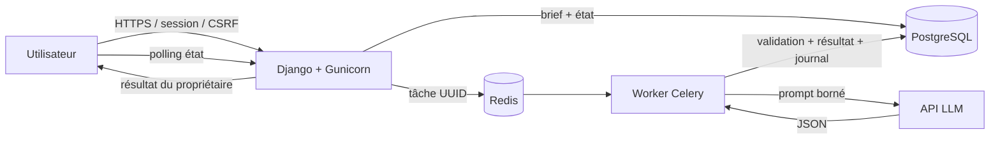
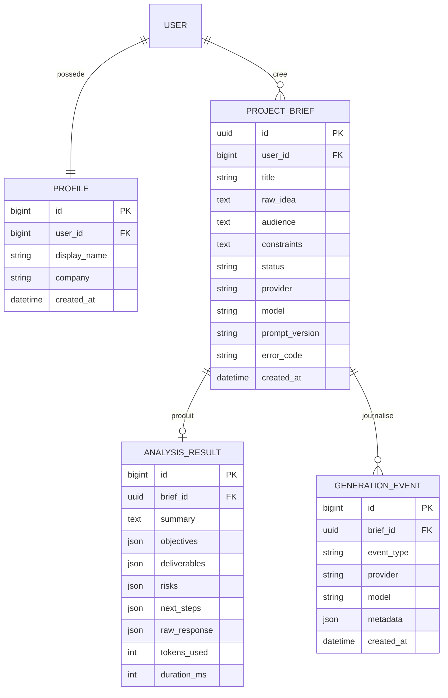
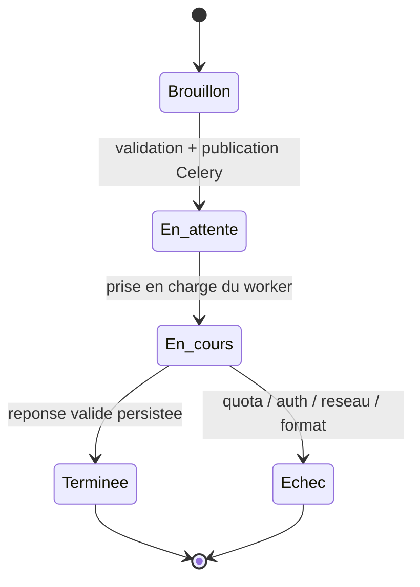

# CadrIA — copilote de brief propulsé par Django & IA

> **Membres du groupe : Hugo Raguin · Amine Taleb · Rizlene Berrag**<br>
> **Production : À COMPLÉTER — https://… (critère éliminatoire)**<br>
> État : socle initial fonctionnel en local ; déploiement public encore à renseigner.

CadrIA transforme une idée de projet encore floue en un brief actionnable : synthèse, objectifs, livrables, risques et
prochaines étapes. Chaque analyse est liée au compte qui l'a créée, exécutée hors de la requête HTTP par Celery, puis
conservée dans l'historique Django.

Le projet suit l'énoncé [Plateforme Web Django & Intelligence Artificielle](https://modules.apti.space/projets/django-ia)
et reprend les bonnes conventions d'architecture, de Docker et d'outillage du dépôt
[theohugo/Projet-carte](https://github.com/theohugo/Projet-carte), sans reprendre sa logique métier Pokémon.

## Ce qui fonctionne déjà

- inscription, connexion, profil automatique et historique privé par utilisateur ;
- création et validation serveur d'un brief ;
- traitement asynchrone Celery via Redis ;
- fournisseurs Mistral, Groq, OpenAI-compatible et Ollama local isolés derrière une interface ;
- réponse JSON validée avant persistance dans PostgreSQL ;
- mode local déterministe `demo`, sans clé ni réseau ;
- progression par polling, skeleton contextualisé et erreurs quota/authentification/réseau explicites ;
- thèmes clair/sombre, responsive, navigation clavier et mouvement réduit ;
- image Docker Python 3.13 slim, non-root, Gunicorn, PostgreSQL, Redis, worker, volumes et healthchecks ;
- tests Django avec appels IA simulés, Ruff, Black, couverture et GitHub Actions ;
- instructions partagées pour Codex (`AGENTS.md`) et Claude Code (`CLAUDE.md`, agents et skills locaux).

> [!IMPORTANT]
> Le fournisseur `demo` est une simulation utile au développement : il ne satisfait pas le critère éliminatoire
> « intégration IA fonctionnelle ». Avant la remise, configurer un vrai modèle, le tester sur l'URL publique et remplacer
> le marqueur « À COMPLÉTER » placé en tête de ce README.

## Démarrage rapide avec Docker

Prérequis : Docker Engine avec le plugin Compose.

```bash
cp .env.example .env
docker compose up --build
```

L'interface est ensuite disponible sur <http://localhost:8000>. Le service `web` applique les migrations et collecte les
statiques ; `worker` traite les briefs ; `db` et `cache` conservent respectivement les données et la file de tâches.
Si le port 8000 est déjà occupé, modifier `CADRIA_PORT` dans `.env` avant le démarrage.
L'override de développement monte le code et utilise `runserver`. Pour valider exactement la commande Gunicorn de
production, sans charger cet override automatique :

```bash
docker compose -f docker-compose.yml up --build
```

Pour créer un administrateur :

```bash
docker compose exec web python manage.py createsuperuser
```

Pour arrêter sans perdre les volumes :

```bash
docker compose down
```

Ne pas ajouter `--volumes` sauf si la suppression de la base locale et de Redis est réellement souhaitée.

## Brancher un vrai modèle IA

Trois chemins sont prévus : Ollama sans clé et sans envoi des briefs hors de la machine, Groq avec une clé et un
quota gratuit limité, ou Mistral/OpenAI-compatible. Dans tous les cas, le worker est le seul service qui appelle le
modèle.

### Option locale légère : Ollama

Le profil `ollama` est désactivé par défaut pour ne pas imposer son image et sa consommation aux contributeurs. Le
modèle conseillé est [`qwen2.5:0.5b`](https://ollama.com/library/qwen2.5) : son fichier quantifié fait environ 398 Mo,
comprend le français et sait produire du JSON. Cette taille privilégie la compatibilité avec un petit ordinateur ; la
qualité sera moins régulière qu'avec un modèle distant plus grand.

Prévoir aussi plusieurs gigaoctets d'espace disque pour l'image Docker Ollama elle-même, en plus du modèle. Le port
Ollama est publié uniquement sur `127.0.0.1` afin de ne pas exposer sans authentification son API au réseau local.

Dans `.env`, changer uniquement le fournisseur ; les variables `OLLAMA_*` de `.env.example` constituent les valeurs
prudentes par défaut :

```dotenv
AI_PROVIDER=ollama
OLLAMA_BASE_URL=http://ollama:11434
OLLAMA_MODEL=qwen2.5:0.5b
OLLAMA_TIMEOUT_SECONDS=120
OLLAMA_NUM_CTX=4096
OLLAMA_KEEP_ALIVE=1m
OLLAMA_MEMORY_LIMIT=2g
OLLAMA_CPU_LIMIT=2.0
```

Télécharger une seule fois le modèle, puis lancer toute la pile avec le profil :

```bash
docker compose --profile ollama up -d ollama
docker compose --profile ollama exec ollama ollama pull qwen2.5:0.5b
docker compose --profile ollama up --build
```

Le service est limité à un modèle chargé, une inférence à la fois, 2 CPU et 2 Go de mémoire. Le contexte de 4 096
tokens et `keep_alive=1m` réduisent aussi la pression mémoire. Ces limites protègent l'hôte contre un emballement du
conteneur, mais Docker, PostgreSQL, Redis et le système consomment encore de la mémoire : fermer les applications
lourdes et surveiller `docker stats` lors du premier essai. Si le port 11434 est déjà pris, changer `OLLAMA_PORT` ; seul
`OLLAMA_BASE_URL` est utilisé entre les conteneurs.

L'API native Ollama est appelée sans streaming avec un schéma JSON, conformément à la documentation des
[sorties structurées Ollama](https://docs.ollama.com/capabilities/structured-outputs). Un 404 indique généralement que
le modèle n'a pas encore été téléchargé. Pour arrêter sans supprimer le modèle :

```bash
docker compose --profile ollama down
```

### Option avec clé et quota gratuit : Groq

Créer une clé dans la [console Groq](https://console.groq.com/keys), puis la conserver uniquement dans `.env` :

```dotenv
AI_PROVIDER=groq
AI_API_KEY=votre-cle-groq-locale
GROQ_BASE_URL=https://api.groq.com/openai/v1
GROQ_MODEL=openai/gpt-oss-20b
GROQ_TIMEOUT_SECONDS=60
```

Au 5 août 2026, Groq documente un **Free Plan** et inclut `openai/gpt-oss-20b` dans ses
[limites gratuites](https://console.groq.com/docs/rate-limits). Ce quota est soumis à des limites de requêtes et de
tokens et peut évoluer : ce n'est ni une gratuité permanente ni une garantie de capacité. Une réponse HTTP 429 est
restituée comme un quota atteint, sans exposer la réponse brute à l'utilisateur.

### Option Mistral ou API compatible OpenAI

Le premier fournisseur cible est Mistral. Modifier uniquement le fichier local `.env` :

```dotenv
AI_PROVIDER=mistral
AI_API_KEY=votre-cle-locale
AI_BASE_URL=https://api.mistral.ai/v1
AI_MODEL=mistral-small-latest
AI_TIMEOUT_SECONDS=60
```

Puis reconstruire/redémarrer le web et le worker :

```bash
docker compose up --build
```

`AI_PROVIDER=openai_compatible` permet d'utiliser un autre service exposant `/chat/completions`, en adaptant
`AI_BASE_URL` et `AI_MODEL`. La clé ne doit jamais être ajoutée à `.env.example`, au Compose, au JavaScript, aux logs ou
à l'historique Git. En production, ces variables doivent être enregistrées dans le gestionnaire de secrets du cloud.

## Architecture technique et pipeline IA



La vue ne contacte jamais le modèle. Elle valide le formulaire, crée le brief dans une transaction, publie son UUID et
rend immédiatement la page de progression. Le worker charge l'objet, le verrouille, passe son état à `processing`,
appelle le service IA, valide le schéma puis écrit le résultat. L'interface interroge un endpoint JSON à intervalle
croissant et recharge la restitution lorsqu'elle devient disponible.

Le résultat est volontairement restitué d'un bloc plutôt qu'en streaming de tokens : CadrIA exige un objet JSON complet
et validé. Le polling maintient l'interface réactive sans exposer une structure partielle ni retenir une connexion HTTP
longue.

### Modèle ORM



### Cycle d'une analyse



## Design System et gestion de la latence

Le référentiel généré avec le skill `ui-ux-pro-max` est conservé dans `design-system/cadria/MASTER.md`. Les tokens
sémantiques de `static/css/tokens.css` pilotent couleurs, surfaces, contraste, espaces, rayons, ombres, typographie et
durées pour les deux thèmes. Le JavaScript et les styles applicatifs sont locaux ; Inter est chargée depuis Google Fonts
avec une pile de polices système en repli si la ressource distante est indisponible.

Pendant l'inférence, l'écran montre trois phases compréhensibles — préparation, analyse et restitution — accompagnées
d'un skeleton dont la géométrie annonce le futur résultat. Un `aria-live` informe les technologies d'assistance. Une
perte réseau déclenche des tentatives espacées et un bouton manuel ; une erreur du modèle explique si l'action attendue
est de patienter ou de contacter l'équipe. `prefers-reduced-motion` neutralise les animations non essentielles.

## Sécurité et confidentialité

- CSRF Django, sessions, mots de passe validés et échappement automatique des templates ;
- requêtes de détail et d'état filtrées par propriétaire pour empêcher les accès par UUID deviné ;
- clé IA lue uniquement côté serveur depuis l'environnement ;
- clé IA injectée dans le worker uniquement, pas dans le processus web ;
- taille d'entrée bornée avant l'appel externe et contenu utilisateur délimité comme donnée dans le prompt système ;
- erreurs publiques normalisées, sans clé, trace interne ou réponse brute ;
- métadonnées d'appel journalisées sans recopier le prompt dans les logs ;
- conteneur applicatif exécuté par un utilisateur système non-root.

Les entrées et réponses sont persistées parce qu'elles constituent le service d'historique demandé. La politique de
conservation et la suppression depuis l'interface font partie de la prochaine itération avant une mise en production
contenant des données réelles.

## Développement sans Docker

Prérequis : Python 3.13, [`uv`](https://docs.astral.sh/uv/) et, pour Celery non eager, un Redis local.

```bash
export DATABASE_URL="sqlite:////$(pwd)/db.sqlite3"
export REDIS_URL="redis://127.0.0.1:6379/0"
uv sync --locked
uv run python manage.py migrate
uv run python manage.py runserver
```

Dans un second terminal :

```bash
uv run celery -A config worker --loglevel=INFO
```

Ces exports remplacent les noms réseau `db` et `cache` du `.env` Docker pour une exécution directe sur l'hôte. Sans
`DATABASE_URL` ni `.env`, Django se replie également sur SQLite. L'environnement Docker et la cible de production
utilisent PostgreSQL.

## Tests, qualité et CI

```bash
uv run python manage.py check
uv run python manage.py makemigrations --check --dry-run
uv run ruff check .
uv run black --check .
uv run coverage run manage.py test
uv run coverage report
docker compose config
```

Les tests du service remplacent le transport HTTP ou le fournisseur par `unittest.mock` : aucune clé ni aucun token ne
sont consommés. `.github/workflows/ci.yml` rejoue les vérifications avec PostgreSQL et Redis à chaque push sur `main` et
à chaque pull request.

## Structure du dépôt

```text
accounts/                 profils, inscription et signaux
briefs/                   ORM, formulaires, vues, tâches et services IA
config/                   réglages Django, URLs et configuration Celery
templates/                pages Django et états de l'expérience IA
static/                   tokens, composants, scripts et favicon locaux
.claude/agents/           rôles Claude Code spécialisés
.claude/skills/           cahier des charges, cours et skill UI/UX
.agents/skills/           skills agents interopérables
design-system/cadria/     source de vérité visuelle persistée
.github/workflows/        intégration continue
```

## Déploiement cloud — à finaliser

La première mise en ligne devra créer quatre briques : service web Gunicorn, worker Celery construit depuis la même
image, PostgreSQL géré et Redis géré. Les variables de `.env.example` seront saisies dans le cloud, `DJANGO_DEBUG=False`,
les domaines/origines HTTPS seront explicitement autorisés, puis
`DJANGO_SECURE_SSL_REDIRECT=True`, `SESSION_COOKIE_SECURE=True`, `CSRF_COOKIE_SECURE=True`,
`SECURE_HSTS_SECONDS=31536000`, `SECURE_HSTS_INCLUDE_SUBDOMAINS=True` et `SECURE_HSTS_PRELOAD=True` seront activés.
Après déploiement :

1. appliquer les migrations et vérifier `/health/` ;
2. créer un compte via l'interface ;
3. lancer un brief avec le vrai fournisseur ;
4. vérifier le worker, l'historique, les statiques et les erreurs publiques ;
5. inscrire l'URL HTTPS et les noms réels tout en haut de ce README.

## Rapport d'ingénierie et post-mortem initial

### Qualité du modèle

Le prompt impose cinq clés JSON, une température basse et sépare explicitement les données utilisateur des
instructions. Ce format rend la sortie testable et directement affichable. Il faudra constituer un petit jeu de briefs
représentatifs et noter la pertinence, la précision, le caractère actionnable et le taux de réponses invalides avant de
choisir définitivement le modèle.

### Coûts et quotas

Chaque résultat conserve le nombre total de tokens annoncé par le fournisseur et la durée, ce qui permettra d'estimer
le coût moyen. Les garde-fous actuels sont la taille d'entrée, un modèle configurable et la température faible. Restent à
ajouter avant ouverture publique : quota par utilisateur, limite de débit, budget mensuel avec alerte et politique de
nouvelle tentative plafonnée.

### Difficultés traitées dans ce socle

- découpler une interaction lente de la requête web grâce à Celery ;
- présenter une progression honnête sans inventer un pourcentage d'inférence ;
- accepter plusieurs APIs compatibles sans propager leurs détails dans les vues ;
- garder un démarrage reproductible tout en proposant un mode sans clé aux contributeurs ;
- préserver un Compose autonome, contrairement au réseau Traefik externe du dépôt d'inspiration.

### Prochaines étapes

- [ ] renseigner les noms complets de l'équipe ;
- [ ] tester un vrai modèle et documenter l'évaluation comparative ;
- [ ] ajouter relance contrôlée, suppression/export et quota par utilisateur ;
- [ ] choisir le stockage objet si des pièces jointes sont ajoutées ;
- [ ] déployer web, worker, PostgreSQL et Redis avec HTTPS ;
- [ ] renseigner l'URL publique et compléter ce post-mortem avec des mesures réelles.
